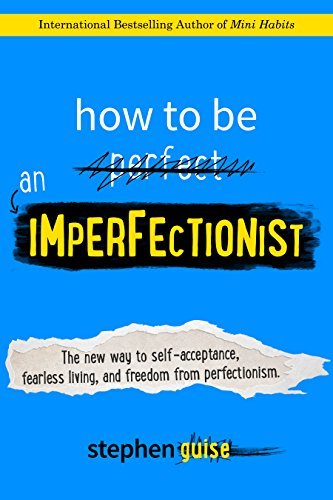

# How to be an Imperfectionist

* ISBN-13: 978-0996435406
* ISBN-10: 0996435409

## What is Perfectionism?
### Definition
A neurological habit of perceiving anything short of perfection as unacceptable.

### Side Effects
* Stay at home
* Not take chances
* Procrastinate on projects
* Makes life seem worse than it is
* Keeps you from being yourself
* Stresses you out
* Tells you that good is bad
* Ignore the natural way things work
* All-or-nothing implementation
    * Partial success is considered failure
    * Only big, smooth, perfect wins are acceptable

### 3 Types of Perfectionistic Standards
* **Context**
    * Location
    * Time
    * Resources
* **Quality**
    * Insistent desire for flawlessness
* **Quantity**
    * Loose 30 pounds of body fat
    * School GPA, GRE, SAT scores

### Precursors to Perfectionism
Perfectionism can be a symptom-producing symptom of some other problem.
* **Insecurity and Inferiority Complex**
    * Hypersensitive focus on personal flaws
    * Unfair standards
* **Discontentment**
    * Not enough
* **Parents and School**
    * Only letter grade 'A' is acceptable
    * Good enough at XYZ

### Benefit of Perfectionism (Perceived Safety)
Desire for greatness and fear of inadequacy are counterforces, and perfectionism
is the only solution that *seems* to address both.  **Perfectionism protects us against symbolic failure**:
* **Two Considerations of Failure**
    1. literal impact of failing
    2. meaning and symbolism
        * Why did he/she say "no"?
        * Am I inadequate, unintelligent, etc?
* **Benefits**
    * If you never attempt something, you can't know empirically that you're not world-class at it.
    * Protection from damage to our confidence and hopes
* **Summary**
    * If you can withstand something undesirable AND it strengthens you,
    **you're far better off "unprotected"** against it.
    
### Types of Perfectionists
* **Overdriven**
    * Never satisfied
    * Unrealistic expectations
    * Rumination
* **Paralyzed**
    * Fear of failure
    * Concerned about mistakes
    * Doubts about actions
* Both types commonly struggle with the **need for acceptance and approval**
    * Hiding
    * Extreme effort

### Forms of Perfectionism
#### Rumination
A desperate, futile attempt to change the past by thinking about it.  The fix is to continue to try,
practice, and improve, and in time, you'll see how ridiculous it is to ever ruminate about something
that you can fix or try again.
* Problems
    * Obsessive focus on problems and events which caused those problems
    * Self-critical thoughts about past performance
    * A harmful response to a life challenge
* Solutions
    * Acceptance of the past as unchangeable
    * Understanding chance vs failure
        * if chance, then persistently keep trying
        * if failure, then you've found one way which does *not* work.  Learn, adapt, and try again. 
    * Focusing on the present
    * Correcting poor self-talk
        * "should have" - a regret
        * "could have" - an alternative
    * Taking action to get your mind to a better place
        * Daily mini-habits

### Problems
* Desire versus Reality impairs progress and happiness
* Romanticized
    * good weakness
    * positive flaw
* Superficial
    * actor pretending
    * nobody is perfect
* Personal standards correlated with depression
    * Striving for excellence
    * High expectations
* Self-Handicapping
    * Protection to have an excuse on hand if things don't work out
    * Puts an asterisk beside your failures
    * Playing it safe, instead of playing to win
    * It won't be satisfying at the end of your life
    to have solid excuses for not doing all the things you wanted to do
    * The road to excellence begins unimpressively
        * We subconciously avoid this rocky path through self-handicapping
        * Come up with an excuse for every stumble
* Creates feelings of guilt, anxiety, inferiority, low self-esteem, and irritability

### Key XOR (exclusive-OR)
In life, you're consistently building up one of two things:
1. Level of Comfort
2. Level of Growth

### Strategies: "Motivation first" versus "Action first"
* **Motivation** is ephemeral, inconsistent, and overvalued by our society as a prerequisite to Action
    * If you treat how you feel as a deciding factor of what you do, you will be a slave to it
    * It's easier to change your mind and emotions by taking action
    than it is to change your actions by trying to think and feel differently
    * As a behavior is repeated, our emotions toward the behavior decrease.
    Repetition is how we learn, as newness fades, so does our emotions towards it.
    * Motivation should be ignored for lasting change
* **Action First Strategy** (*not* motivation first, since motivation is inconsistent)
    * Action through willpower (regardless of movitation, circumstances, time, resources, etc)
    * Action itself is the best starting point for more action
    * Changes how we feel
    * Increases motivation

### What is Imperfectionism?
Prioritizing doing by taking away the crippling fear of *not* doing well.

### Benefits of Imperfectionism
* Reduced stress
* Greater results by taking positive action in more situations
* Fearless, confident, freedom
* Live life to the fullest
* Fewer limits, more enjoyment
* Satisfaction, happiness, joy, calm, and a healthy sense of self-worth

### How to become an imperfectionist
In general, the idea behind imperfectionism is to *not* care so much about conditions or results,
and care more about what you can do right now to move forward with your identity and your life.
When you care less about the result of a process, it makes the process itself easier.
* **Result Apathy**
    * Care less about results.  Care more about putting in the work.  Focus on the process.
    * Care less about problems.  Care more about making progress despite them.  Focus on solutions.
    * Care less about what other people think.  Care more about who you want to be and what you want to do.
    * Care less about doing it right.  Care more about doing it all.
    * Care less about failure.  Care more about success.
    * Care less about timing.  Care more about the task.
* **Golden mindset:** Do your best and do *not* care how it turns out.
    * Perfectionists use their desire for positive results to motivate them to go through the process
    * Imperfectionists focus on the process and let the results take care of themselves
        * Focus on what you control, the process, *not* the results

### Examples
* NAVY SEAL's
    * no matter how hard it gets and how bleak it looks, the best move is
    to determine and execute the next step
    * difficult processes become easier with "one step at a time" thinking;
    they are made nearly impossible by looking ahead
        * start the process and see what happens
        * focus on the process

### Solutions
* Change what I care about and focus my mind upon
    * Focus on process *not* results
        * Small, consistent, incremental steps
* Proper expectations
    * Our emotions are largely derived from our expectations
    * Transformation does *not* happen quickly, the brain must have enough repetition over time
    to form new neural pathways
    * Have high overall expectations, but low specific expectations (shit happens)
* Focus on what's right with your life
* Choose to have enough and enjoy the freedom and joy that follows
    * **"never enough"** -- perfectionist's unrealistic expectations
        * Anxiety, frustration, hopelessness, no end in sight, no satisfaction, general discontent
    * **"not quite enough"** -- imperfectionist's healthy ambition to grow 
        * Eagerness, excitement, hope
* Whatever you want **to do more in life** -- exercise, write, read, swim, dance, sing, laugh, and so on --
**lower the bar for doing it**.
    * Make it a causual, regular habit each day 

## Quotes
* *"Strive for continuous improvement, instead of perfection."* **-Kim Collins**
* *"To be yourself in a world that is constantly trying to make you something else is the greatest accomplishment."* **-Ralph Waldo Emerson**
* *"If you look for perfection, you'll never be content"* **-Leo Tolstoy**
* *"Striving for excellence motivates you; striving for perfection is demoralizing."* **-Harriet Braiker**
* *"When one's expectations are reduced to zero, one really appreciates everything one does have."* **-Stephen Hawking**
* *"The tricky thing about rumination is that it feels like it's helpful, but there's no action taken, and you don't move forward to some sort of solution"* **-Carla Grayson**
* *"People who want the most approval get the least and people who need approval the least get the most."* **-Wayne Dyer**

### Categorized Quotes from Kurt Cobain's Suicide Note

#### Unrealistic Expectations
* *"I've tried everything within my power to appreciate it (and I do,God, believe me I do, but it's **not enough**)"*
* *"For example when we're back stage and the lights go out and the manic roar of the crowds begins., **it doesn't affect me** the way in which it did for Freddie Mercury, who seemed to love, relish in the the love and adoration from the crowd which is something I totally admire and envy."*

#### Personal Flaws and Rumination
* *"I'm **too sensitive**. I need to be slightly numb in order to regain the enthusiasms I once had as a child."*
* *"I think I simply love people **too much**, so much that it makes me feel **too fucking sad**."*
* *"I love and feel sorry for people **too much** I guess"*

#### Hopeless, Fearful Future
* *"... **terrifies me to the point to where I can barely function**. I can't stand the thought of Frances becoming the miserable, self-destructive, death rocker that I've become"*
* *"For her life, which **will be** so much **happier without me**."*
